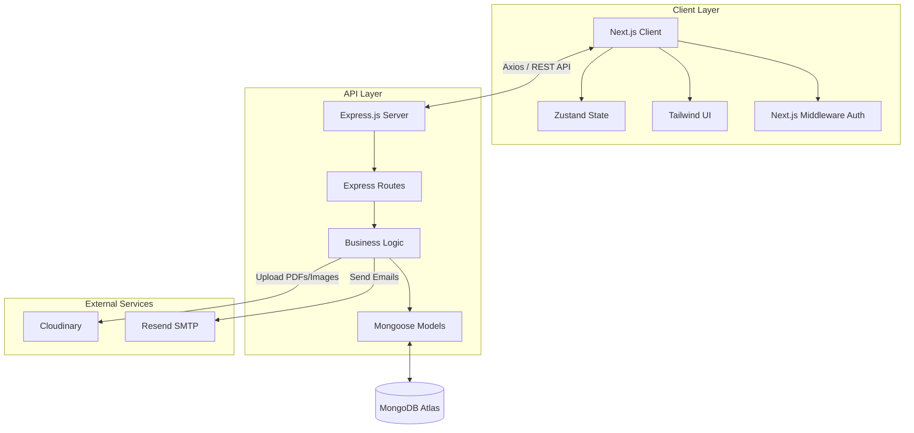
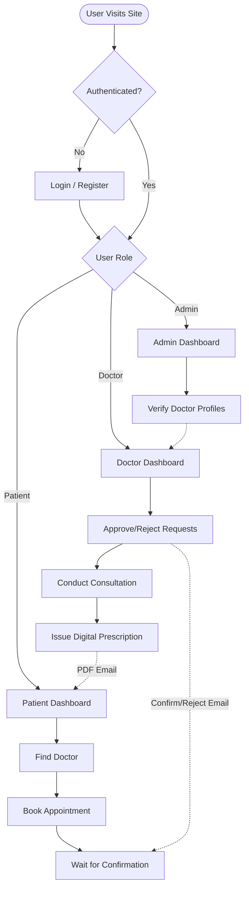

<div align="center">
  
  # 🏥 CareSync

  **A Modern, Production-Ready Healthcare Management Platform**

  [](https://nextjs.org/)
  [](https://nodejs.org/)
  [](https://www.mongodb.com/)
  [](https://tailwindcss.com/)
  
</div>

<br/>

CareSync is a comprehensive, full-stack healthcare platform built on the **MERN** stack (MongoDB, Express, React/Next.js, Node.js). It seamlessly connects patients with verified medical professionals, handling everything from secure appointment booking and digital PDF prescriptions to health record sharing and administrative oversight.

---

## ✨ Key Features

### 👤 For Patients
- **Smart Discovery:** Search for doctors by name, or filter by specialization, consultation fee, and rating.
- **Frictionless Booking:** View a doctor's weekly schedule and book available time slots with real-time conflict prevention.
- **Health Records Vault:** Securely upload medical documents (PDFs & Images) to Cloudinary and selectively share them with specific doctors.
- **Digital Prescriptions:** Receive and download beautifully formatted PDF prescriptions instantly.
- **Review System:** Leave 5-star ratings and feedback for doctors after completed visits.

### 👨‍⚕️ For Doctors
- **Profile & Schedule Builder:** Manage your bio, qualifications, fee, and build a custom weekly availability schedule.
- **Appointment Management:** Accept or reject incoming patient requests from a streamlined dashboard.
- **Prescription Writer:** Use a dynamic, multi-row form to issue medicines. The system automatically compiles this into a branded PDF and emails the patient.
- **Shared Records:** Securely view health records shared with you by your patients.

### 🛡️ For Administrators
- **Platform Analytics:** View real-time platform statistics including a Recharts-powered pie chart of appointment statuses.
- **Doctor Verification:** Review pending doctor applications to ensure only qualified professionals join the platform. Automated emails notify doctors of approval/rejection.

---

## 🛠️ Technology Stack

### **Frontend**
*   **Framework:** Next.js 14 (App Router)
*   **Styling:** Tailwind CSS (Custom teal medical branding)
*   **State Management:** Zustand (Session & Role management)
*   **Forms & Validation:** React Hook Form + Zod
*   **Data Visualization:** Recharts
*   **HTTP Client:** Axios (Configured with interceptors)
*   **Alerts:** Sonner

### **Backend**
*   **Core:** Node.js, Express.js
*   **Database:** MongoDB, Mongoose
*   **Authentication:** JSON Web Tokens (JWT), bcryptjs
*   **File Storage:** Cloudinary, Multer (Memory Storage)
*   **Document Generation:** PDFKit
*   **Email Service:** Nodemailer configured with Resend SMTP
*   **Security:** Helmet, express-rate-limit, cors

---

## 🏗️ System Architecture

CareSync follows a decoupled Client-Server architecture:



1. **Client Layer (Next.js):** Handles UI rendering, client-side routing, and state management (Zustand). Uses Axios interceptors to attach JWT tokens to every request. Next.js Middleware protects route groups (`/admin`, `/doctor`, `/dashboard`) based on the JWT payload.
2. **API Layer (Express.js):** RESTful API that processes business logic, validates payloads (express-validator), and handles authorization (`protect` and `authorize` middleware).
3. **Database Layer (MongoDB):** Relational-style document modeling using Mongoose `populate()`. (e.g., An `Appointment` references a `Patient`, a `Doctor`, and optionally a `Prescription`).
4. **External Services:**
   - **Cloudinary:** Used for uploading Health Records and system-generated PDF prescriptions via memory-buffered streams.
   - **Resend (SMTP):** Dispatches automated, branded HTML emails for appointment confirmations and prescription deliveries.

---

## 🔄 Core User Flows



### 1. The Patient Journey
*   **Onboarding:** Registers as a 'patient' and lands on the Patient Dashboard.
*   **Discovery:** Navigates to "Find Doctors" and filters specialists based on needs.
*   **Booking:** Selects a date on the Doctor's profile, views available slots mapped for that specific day, and requests an appointment.
*   **Consultation & Beyond:** Once the doctor confirms, the patient receives an email. After the visit, the patient can download their digital prescription and leave a 1-5 star review.

### 2. The Doctor Journey
*   **Onboarding:** Registers as a 'doctor'. Account goes into a `pending` state until an Admin verifies them.
*   **Setup:** Once verified via email, the doctor sets their consultation fee, bio, and weekly availability schedule (e.g., Mon: 09:00-17:00).
*   **Daily Workflow:** Logs in to see "Pending Requests" and "Today's Schedule". Approves incoming patient requests.
*   **Prescribing:** Clicks "Write Prescription" on a completed appointment, fills out the dynamic medicine form, and clicks Submit. The server generates a PDF, uploads it, and emails the patient.

### 3. The Admin Journey
*   **Oversight:** Logs into the protected Admin panel to view real-time Recharts visualizations of platform health (Total Patients, Appointments distribution).
*   **Quality Control:** Reviews the credentials of newly registered doctors and clicks "Approve" or "Reject", immediately triggering a notification email to the doctor.

---

## 🚀 Getting Started

### Prerequisites
*   Node.js (v18+)
*   MongoDB URI
*   Cloudinary Account
*   Resend (or any SMTP provider) Account

### 1. Clone the repository
```bash
git clone https://github.com/HarshJasani9/CareSync.git
cd CareSync
```

### 2. Backend Setup
```bash
cd backend
npm install
```

Copy the provided `.env.example` file to create your `.env` file:
```bash
cp .env.example .env
```
Then, update the `.env` file with your specific credentials:
```env
PORT=5000
NODE_ENV=development
MONGO_URI=your_mongodb_connection_string

JWT_SECRET=your_jwt_secret
JWT_EXPIRE=30d

CLOUDINARY_CLOUD_NAME=your_cloud_name
CLOUDINARY_API_KEY=your_api_key
CLOUDINARY_API_SECRET=your_api_secret

EMAIL_HOST=smtp.resend.com
EMAIL_PORT=465
EMAIL_USER=resend
EMAIL_PASS=your_resend_api_key
EMAIL_FROM=onboarding@resend.dev

FRONTEND_URL=http://localhost:3000
```

Start the backend server:
```bash
npm run dev
```

### 3. Frontend Setup
Open a new terminal window.
```bash
cd frontend
npm install
```

Copy the provided `.env.example` file to create your `.env.local` file:
```bash
cp .env.example .env.local
```
Then, ensure the API URL points to your backend:
```env
NEXT_PUBLIC_API_URL=http://localhost:5000/api
```

Start the Next.js development server:
```bash
npm run dev
```

### 4. Seed Demo Data (Optional)
Populate the database with **5 sample patients** and **8 verified doctors** so the app looks production-ready out of the box.

```bash
cd backend
node seed.js
```

To remove all seeded data later:
```bash
node seed.js --clear
```

<details>
<summary><strong>📋 Demo Account Credentials</strong> (click to expand)</summary>
<br>

**Password for all accounts:** `Test@123`

#### Patients
| Name | Email |
|------|-------|
| Aarav Mehta | `aarav.mehta@demo.com` |
| Priya Sharma | `priya.sharma@demo.com` |
| Rohan Gupta | `rohan.gupta@demo.com` |
| Ananya Reddy | `ananya.reddy@demo.com` |
| Vikram Singh | `vikram.singh@demo.com` |

#### Doctors
| Name | Specialization | Fee | Rating |
|------|---------------|-----|--------|
| Dr. Neha Kapoor | Cardiology | ₹1500 | 4.8 ⭐ |
| Dr. Rajesh Iyer | Orthopedics | ₹1200 | 4.6 ⭐ |
| Dr. Sanya Patel | Dermatology | ₹800 | 4.9 ⭐ |
| Dr. Arjun Nair | Pediatrics | ₹700 | 4.7 ⭐ |
| Dr. Meera Joshi | Psychiatry | ₹1000 | 4.5 ⭐ |
| Dr. Karan Malhotra | General Practice | ₹500 | 4.4 ⭐ |
| Dr. Ishita Banerjee | Neurology | ₹1800 | 4.3 ⭐ |
| Dr. Aditya Verma | Gastroenterology | ₹1400 | 4.6 ⭐ |

</details>

---

## 📁 Folder Structure

```text
CareSync/
├── backend/
│   ├── config/         # Database configuration
│   ├── controllers/    # API business logic (Auth, Doctors, Appointments, etc.)
│   ├── middleware/     # Auth checks, error handling, file upload, validation
│   ├── models/         # Mongoose schemas
│   ├── routes/         # Express route definitions
│   ├── utils/          # PDF generation & Email transport templates
│   └── seed.js         # Database seeder for demo data
│
└── frontend/
    ├── app/            # Next.js 14 App Router layout
    │   ├── (admin)/    # Protected admin routes & dashboard
    │   ├── (auth)/     # Login & Multi-step Registration
    │   ├── (patient)/  # Protected patient routes
    │   └── doctor/     # Protected doctor routes & public profiles
    ├── lib/            # Axios interceptor setup
    └── store/          # Zustand global state (AuthStore)
```

---

## 🔒 Security Measures
*   **Role-Based Access Control (RBAC):** Backend endpoints and frontend routes are strictly guarded by `patient`, `doctor`, and `admin` roles.
*   **JWT & Cookies:** Tokens are stored in localStorage for Axios and synced to cookies for Next.js Middleware route protection.
*   **Rate Limiting:** Protects the API from DDoS and brute force attacks.
*   **Orphan File Cleanup:** Deleting a health record automatically triggers a deletion request to Cloudinary via `publicId` to prevent storage leaks.

---

<div align="center">
  <i>Designed and built for modern healthcare management.</i>
</div>
